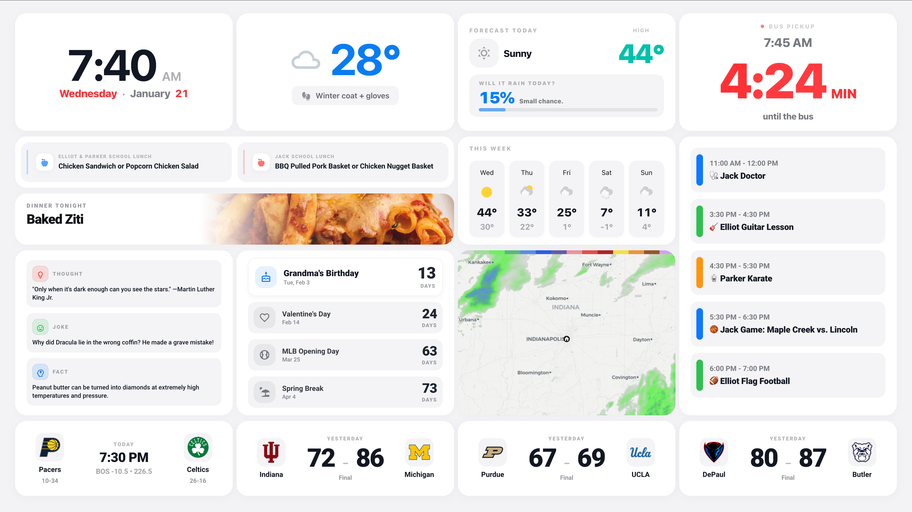

# 🏠 Family Wallboard Dashboard for Home Assistant

[](https://www.home-assistant.io/)
[](https://hacs.xyz/)
[](LICENSE)

A beautiful, family-friendly kiosk dashboard for Home Assistant featuring weather, calendars, school information, sports scores, and countdown timers. Designed for high "Spouse Acceptance Factor" and glanceability.



## ✨ Features

- **Time & Date** — Large, readable clock with dynamic date display
- **Weather** — Current conditions, forecast, precipitation probability, and clothing recommendations
- **Weekly Forecast** — 5-day weather outlook
- **Radar Map** — Animated weather radar
- **Family Calendar** — Color-coded events for each family member
- **School Lunch Menus** — Rotating lunch menus for up to 2 schools
- **Dinner Tonight** — Meal planning integration with food images
- **Countdown Timers** — Birthdays, holidays, and special events
- **School Bus Timer** — Countdown to bus arrival with late-start support
- **Sports Tracker** — Live scores for up to 4 teams
- **Daily Fun** — Thought of the day, jokes, and fun facts

## 📋 Requirements

### Home Assistant
- Home Assistant 2024.1.0 or newer
- HACS (Home Assistant Community Store)

### Required HACS Cards
| Card | Repository |
|------|------------|
| Button Card | `custom-cards/button-card` |
| Layout Card | `thomasloven/lovelace-layout-card` |
| Card Mod | `thomasloven/lovelace-card-mod` |
| Kiosk Mode | `NemesisRE/kiosk-mode` |
| Weather Radar Card | `Makin-Things/weather-radar-card` |
| Week Planner Card | `FamousWolf/week-planner-card` |

### Required Integrations
| Integration | Purpose |
|-------------|---------|
| Weather (Met.no) | Default weather provider (or any other) |
| Calendar (Google/Local) | Family events |
| Team Tracker (HACS) | Sports scores (optional) |

## 🚀 Quick Start

1. **Install HACS cards** — See [HACS_CARDS.md](docs/HACS_CARDS.md)
2. **Copy files** — See [INSTALL.md](INSTALL.md)
3. **Configure entities** — See [CONFIGURATION.md](CONFIGURATION.md)
4. **Restart Home Assistant**
5. **Add the dashboard**

📖 **Full installation guide:** [INSTALL.md](INSTALL.md)

## 📁 Repository Structure

```text
wallboard-dashboard/
├── dashboards/
│   └── wallboard.yaml          # Main dashboard UI
├── themes/
│   └── wallboard_theme.yaml    # Apple-style theme
├── packages/
│   └── wallboard_package.yaml  # Logic, Sensors & Automations
├── examples/                   # ⚠️ COPY CONTENTS TO /config/wallboard/
│   ├── entities.yaml.example   # Entity mapping
│   ├── events.yaml.example     # Countdown events
│   ├── school_calendar.yaml.example
│   └── school_menus.yaml.example
├── www/
│   ├── school_1_logo.png       # Placeholder logo
│   └── school_2_logo.png       # Placeholder logo
└── docs/
    ├── HACS_CARDS.md
    ├── SCREENSHOTS.md
    └── CUSTOMIZATION.md
```

## ⚙️ Configuration Overview

This dashboard uses a **mapping file approach** — you configure your entities in one place, and the dashboard references them automatically.

1. Create a folder in Home Assistant: `/config/wallboard/`
2. Copy `examples/*.example` files into that folder
3. Rename them to remove `.example` (e.g., `entities.yaml`)
4. Edit `entities.yaml` to map your real Home Assistant entities

See [CONFIGURATION.md](CONFIGURATION.md) for detailed instructions.

## 🎨 Customization

- **Theme colors** — Edit `themes/wallboard_theme.yaml`
- **Grid layout** — Modify grid areas in `dashboards/wallboard.yaml`
- **Remove features** — Delete card sections you don't need
- **Add teams** — Configure Team Tracker sensors

See [docs/CUSTOMIZATION.md](docs/CUSTOMIZATION.md) for advanced options.

## 🐛 Troubleshooting

Having issues? Check [TROUBLESHOOTING.md](TROUBLESHOOTING.md) for:
- Common installation problems
- Entity configuration errors
- Card rendering issues
- Performance optimization

## 📸 Screenshots

See [docs/SCREENSHOTS.md](docs/SCREENSHOTS.md) for full dashboard screenshots.

## 🤝 Contributing

Contributions are welcome! Please read [CONTRIBUTING.md](CONTRIBUTING.md) first.

## 📄 License

This project is licensed under the MIT License — see [LICENSE](LICENSE) for details.

## 🙏 Credits

- Inspired by the Home Assistant community
- Weather data from [Met.no](https://www.met.no/)
- Daily fun facts from [Be A Great Teacher](https://www.beagreatteacher.com/)
- Sports data via [Team Tracker](https://github.com/vasqued2/ha-teamtracker)

## ☕️ Tip Jar
If this dashboard saved you time, you can buy me a coffee: https://ko-fi.com/musicjock

---

**Questions?** Open an issue, but please check [TROUBLESHOOTING.md](TROUBLESHOOTING.md) first!
```
