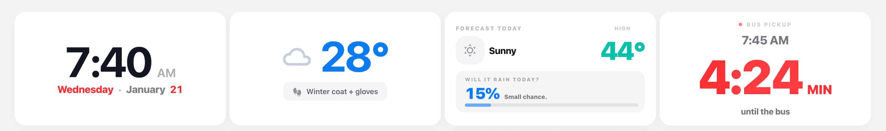
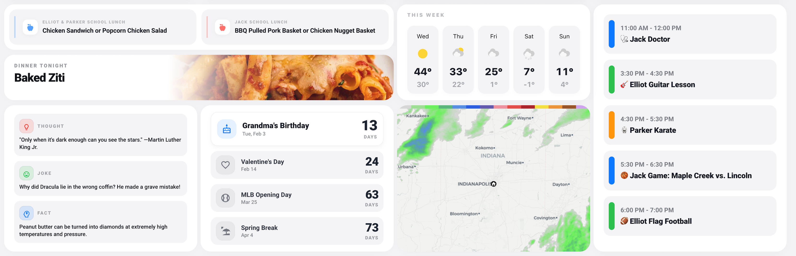
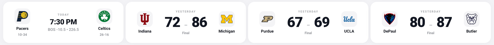

# Screenshots

## Dashboard Overview

*Full dashboard view showing all cards*

---

## Card Details

### Time & Weather Row

- **Time Card:** Large clock with AM/PM, weekday, and date
- **Current Weather:** Temperature with clothing recommendation
- **Forecast:** High temp, precipitation probability, "Will it rain?" display
- **Bus Timer/Next Up:** Countdown to bus arrivial or upcoming calendar event with countdown

### Main Content Row

- **Lunch Cards:** Today's menu for up to 2 schools
- **Dinner Tonight:** Meal name with food image from calendar
- **Weekly Forecast:** 5-day weather outlook
- **Family Calendar:** Color-coded events for today
- **Daily Fun:** Thought, joke, and fact of the day
- **Countdown:** Next 4 upcoming events with days remaining
- **Radar:** Animated weather radar

### Sports Row

- **Sports:** Live scores for up to 4 teams

---

## Add Your Own Screenshots

After installing, take screenshots of your dashboard and add them to the `docs/screenshots/` folder. Then update this file to reference them.

### Taking Screenshots

**On Desktop:**
- Windows: Win+Shift+S
- Mac: Cmd+Shift+4
- Linux: Use screenshot tool

**In Home Assistant:**
1. Open dashboard in full screen (F11)
2. Hide any browser UI
3. Take screenshot

**From Tablet:**
- Most tablets have screenshot buttons
- Or use screen recording software
